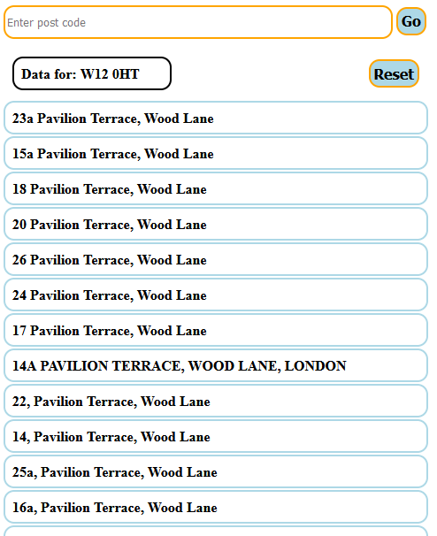
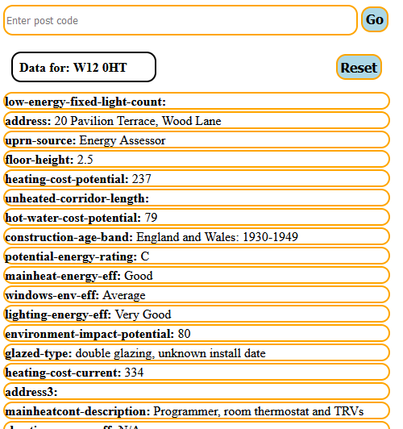

## Task:

Create a Report Which Uses EPC Data to display information about a given address. (EPC is Energy Performance data gathered about a building / address to show how energy efficient the property is).

Use the Energy Performance Certificates API - which is an open API of publicly available energy performance data.
You can Register for your own API key, or we can provide a key to use if required.

## Code Requirements:

    Code should be written in JavaScript or PHP. The resulting code should not have any external dependencies required to run
    Code should be easy to read & the front-end HTML/CSS should follow W3C standards
    You can choose to create your own API Key, or we can provide one for you to use (see link in the sidebar).

## Functionality Requirements:

    Allow the user to Input a UK Residential Address/Postcode using a HTML Form
    Find & display suitable matching records in the API based on the address / postcode they provide
    Allow the user to then select a single property and display the full EPC details available.
    Optional: Include some analysis of the returned data, for example this could include:
        Comparison of the energy performance of this property to other neighbouring/nearby properties, using an average of their performance.
        Or changes compared to any previous EPC for the same address, such as an increase/decrease of some numbers, or the addition/removal of recommended actions.

# EPC Report app

A light app that fetches data from the Energy Performance Certificates API based on the post code entered by the user and displays the full details when the user selects a specific address.

## How to use

1. Clone this repository to your local machine.
2. Navigate to the project directory.
3. Open the "index.html" file in your browser.
4. There are no dependencies that need installing.

## Features

- Fetch data from Energy Performance Certificates API based on the post code entered by the user
- Display a list of addresses for each post code
- Display full details for selected address
- Clear the input box after fetching and displaying the data
- Button that resets the page to ease the search process

## Technologies used

- HTML
- CSS
- Vanilla JavaScript

## API used

- Energy Performance Certificates API (https://epc.opendatacommunities.org/docs/api/domestic)

## How it works

1. When the app is loaded, it fetches data for the default post code (SL1 5BW) and it displays the addresses on the page.
2. The user can enter a post code in the input box.
3. Clicking the "Go" button will fetch data for the entered post code.
4. Clicking on an address will return the full details for the selected line.
5. The input box is cleared when the user presses "Go".
6. Pressing the reset button will refresh the page.

Have a lovely day!